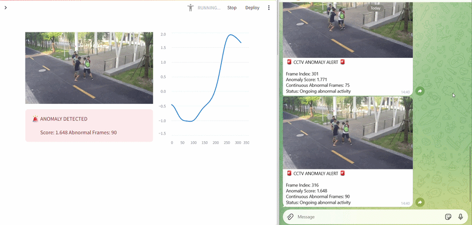

# 🎥 AI CCTV Anomaly Detection System
### Zero-Shot Video Anomaly Detection using CLIP + YOLO on ShanghaiTech Campus Dataset

<p align="center">
  
  
  
  
  
</p>

<p align="center">
  <b>Detects anomalous events in surveillance footage — without training on a single abnormal sample.</b>
</p>

---

## 🎬 Live Demo

> Real-time anomaly detection on ShanghaiTech Campus Dataset — Streamlit dashboard (left) + Telegram Bot alert (right)

<p align="center">
  
</p>

> 🚨 Score spikes to **1.771** as the system detects an ongoing abnormal event across 90 consecutive frames — Telegram Bot simultaneously pushes the annotated frame screenshot to subscribers.

---

## 📌 Overview

Traditional CCTV systems require constant human monitoring — inefficient, expensive, and error-prone at scale. This project presents a **zero-shot anomaly detection framework** that uses vision-language AI to automatically identify suspicious events in real-time surveillance footage.

Instead of training a supervised classifier on labeled abnormal videos, the system uses **natural language descriptions** of abnormal behaviors and compares them against live video frames using the **CLIP model** — no abnormal training data required.

The system is evaluated on the **ShanghaiTech Campus Dataset**, a standard research benchmark for video anomaly detection, and deployed with a **Streamlit real-time dashboard** and **Telegram Bot alerting**.

---

## ✨ Key Features

- 🚫 **Zero-shot detection** — no abnormal training samples needed
- 🧠 **Vision-Language AI** — CLIP compares frames against text descriptions of anomalies
- 🔍 **Object-level analysis** — YOLO crops individual objects before CLIP scoring for precision
- 📊 **Robust scoring pipeline** — Softmax → Z-score normalization → Gaussian temporal smoothing
- 🖥️ **Real-time Streamlit dashboard** — live CCTV playback + anomaly score graph
- 🔔 **Telegram Bot alerts** — auto-pushes frame screenshots to subscribers when anomaly is detected
- 🛠️ **Prompt-engineered** — iteratively improved detection via custom text prompts

---

## 🎯 Anomalies the System Can Detect

| Category | Examples |
|---|---|
| **Violence** | Fighting, physical altercation, aggressive behavior |
| **Dangerous Motion** | Running suddenly, people scattering, panic movement |
| **Unauthorized Vehicles** | Motorbike on campus, car on pedestrian walkway |
| **Object Throwing** | Person throwing a bag, object thrown violently |
| **Chasing** | Person chasing another, aggressive pursuit |
| **Falling** | Person falling down suddenly |

---

## 🏗️ System Architecture

```
Video Input
    │
    ▼
Frame Extraction (256×256)
    │
    ▼
YOLO Object Detection
(Person, Bicycle, Motorbike, Car...)
    │
    ▼
Object Cropping → CLIP Image Encoder → 512-dim Image Embeddings
                                              │
Custom Text Prompts → CLIP Text Encoder → 512-dim Text Embeddings
                                              │
                                              ▼
                               Cosine Similarity Computation
                                              │
                                              ▼
                                   Softmax → Probabilities
                                              │
                                              ▼
                               P(abnormal) = Σ P(abnormal prompts)
                                              │
                                              ▼
                                  Z-score Normalization
                                              │
                                              ▼
                               Gaussian Temporal Smoothing
                                              │
                                              ▼
                          Threshold Decision: NORMAL / ANOMALY
                                              │
                               ┌──────────────┴──────────────┐
                               ▼                             ▼
                    Streamlit Dashboard            Telegram Bot Alert
                  (Live Playback + Graph)     (Screenshot → Subscribers)
```

---

## 📂 Dataset

**ShanghaiTech Campus Dataset**

| Property | Details |
|---|---|
| Cameras | 13 surveillance cameras |
| Environment | University campus (indoor + outdoor) |
| Training set | Normal activities only |
| Testing set | Normal + Abnormal activities |
| Ground truth | Frame-level binary masks (0 = Normal, 1 = Abnormal) |
| Evaluation metric | Frame-level ROC-AUC |

> ⚠️ Dataset is not included in this repository due to size constraints.
> Download from: [ShanghaiTech Campus Dataset](https://svip-lab.github.io/dataset/campus_dataset.html)

---

## 🚀 Getting Started

### Prerequisites
```bash
pip install torch torchvision
pip install openai-clip
pip install ultralytics
pip install streamlit
pip install opencv-python
pip install pandas numpy scipy
pip install requests
```

### Installation
```bash
git clone https://github.com/Deep-ii/Anomaly_Detection-On-ShanghaiTech-University.git
cd Anomaly_Detection-On-ShanghaiTech-University
pip install -r requirements.txt
```

### Running the Pipeline

**Step 1 — Extract frames from video:**
```bash
python crop.py
```

**Step 2 — Generate CLIP text embeddings:**
```bash
python text_features.py
```

**Step 3 — Run CLIP image embeddings + scoring:**
```bash
python embed_Clip_Train.py
python final_scoring_.py
```

**Step 4 — Visualize output:**
```bash
python final_visualize_output.py
```

**Step 5 — Launch real-time dashboard:**
```bash
python telegram_listener.py   # Terminal 1
streamlit run app.py          # Terminal 2
```

---

## 📊 Results

| Metric | Details |
|---|---|
| Evaluation | Frame-level ROC-AUC on ShanghaiTech testing set |
| Approach | Zero-shot (no abnormal training samples) |
| Smoothing | Gaussian temporal smoothing (σ=5) |
| Normalization | Z-score using training video statistics |
| Max Anomaly Score Observed | 1.771 (continuous 90-frame anomaly event) |

---

## ⚠️ Limitations

- Detection is **prompt-dependent** — behaviors not described in prompts will not be flagged
- No explicit **temporal modeling** — analysis is frame-by-frame, not sequential
- CLIP was not trained specifically for surveillance — performance varies with lighting/camera angle
- Performance depends on **YOLO detection quality** (missed detections = missed anomalies)

---

## 🔮 Future Work

- [ ] Prototype-based fine-tuning of CLIP text embeddings for surveillance domain
- [ ] Optical flow integration for motion-based anomaly detection
- [ ] Transformer-based temporal modeling across frame sequences
- [ ] Adaptive threshold selection per camera/scene
- [ ] LLM-assisted automatic prompt expansion
- [ ] Multi-camera simultaneous monitoring support

---

## 📁 Repository Structure

```
Anomaly_Detection-On-ShanghaiTech-University/
│
├── app.py                      # Streamlit dashboard + Telegram alerting
├── telegram_listener.py        # Telegram Bot subscription handler
├── crop.py                     # Frame extraction from video
├── crop_test.py                # Frame extraction for test set
├── detection_training.py       # YOLO object detection pipeline
├── embed_Clip_Train.py         # CLIP image embedding generation
├── text_features.py            # CLIP text prompt encoding
├── final_scoring_.py           # Anomaly scoring + smoothing pipeline
├── final_visualize_output.py   # Score visualization
└── README.md
```

---

## 👤 Author

**Deep Isalaniya**
MSc Data Science — Marwadi University, Rajkot

[](https://github.com/Deep-ii)
[](https://linkedin.com/in/deep-isalaniya-a866642b9)
[](mailto:deep2479mission@gmail.com)

---

## 📄 References

- [CLIP: Learning Transferable Visual Models From Natural Language Supervision](https://arxiv.org/abs/2103.00020) — Radford et al., OpenAI
- [ShanghaiTech Campus Dataset](https://svip-lab.github.io/dataset/campus_dataset.html) — Liu et al.
- [YOLOv8 by Ultralytics](https://github.com/ultralytics/ultralytics)

---

<p align="center">
  <i>Built as part of MSc Data Science research at Marwadi University, Rajkot</i>
</p>
